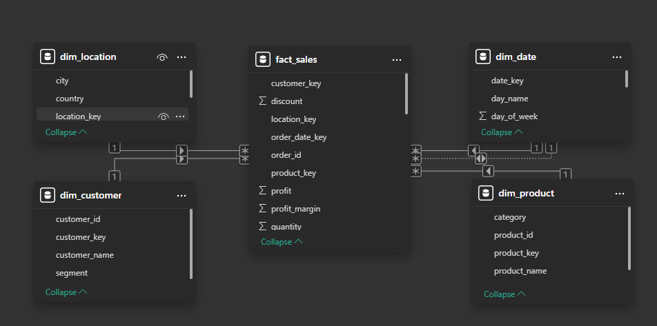
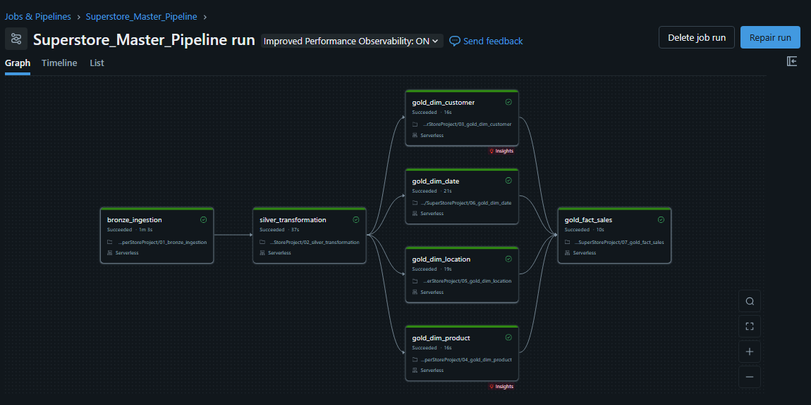

# Superstore End-to-End Data Engineering Project

An end-to-end Data Engineering pipeline built on **Databricks Community Edition** using **PySpark**, **Delta Lake**, and **Medallion Architecture** (Bronze → Silver → Gold), with a **Power BI dashboard** for business intelligence.

---

## Project Overview

This project simulates a real-world Data Engineering workflow using the Sample Superstore retail dataset. The goal was to build a production-style data pipeline that ingests raw CSV data, transforms and validates it through multiple layers, models it into a Star Schema for analytics, and surfaces business insights through an interactive dashboard.

**Dataset:** US Retail Superstore | 9,994 records | January 2014 — December 2017
**Domain:** Office Supplies, Furniture, Technology sales across 4 US regions

---

## Architecture

```
CSV File (Kaggle - Sample Superstore)
        ↓
┌──────────────────────────────────┐
│          BRONZE LAYER            │
│  Raw ingestion, no transforms    │
│  All columns stored as strings   │
│  superstoreprac.bronze.brz_table │
└──────────────────────────────────┘
        ↓
┌──────────────────────────────────┐
│    DATA QUALITY CHECKS           │
│  5 automated validation gates    │
│  Pipeline stops if checks fail   │
└──────────────────────────────────┘
        ↓
┌──────────────────────────────────┐
│          SILVER LAYER            │
│  Cleaned, typed, deduplicated    │
│  Partitioned by region           │
│  superstoreprac.silver.slv_table │
└──────────────────────────────────┘
        ↓
┌──────────────────────────────────────────────────────┐
│                    GOLD LAYER                         │
│             Star Schema - Dimensional Model           │
│                                                       │
│  dim_customer  dim_product  dim_location   dim_date   │
│                       ↓                              │
│                   fact_sales                         │
└──────────────────────────────────────────────────────┘
        ↓
┌──────────────────────────────────┐
│       POWER BI DASHBOARD         │
│  5-page interactive dashboard    │
└──────────────────────────────────┘
```

---

## Tech Stack

| Tool | Purpose |
|------|---------|
| Databricks Community Edition | Cloud compute and notebook environment |
| PySpark | Distributed data processing |
| Delta Lake | ACID-compliant storage with time travel |
| Unity Catalog | Data governance and catalog management |
| SQL | Data modeling and transformation |
| Databricks Jobs | Pipeline orchestration |
| Power BI Desktop | Business intelligence dashboard |

---

## Repository Structure

```
Superstore-Data-Engineering/
├── README.md
├── notebooks/
│   ├── 01_bronze_ingestion.ipynb
│   ├── 02_silver_transformation.ipynb
│   ├── 02b_data_quality_checks.ipynb
│   ├── 03_gold_dim_customer.ipynb
│   ├── 04_gold_dim_product.ipynb
│   ├── 05_gold_dim_location.ipynb
│   ├── 06_gold_dim_date.ipynb
│   ├── 07_gold_fact_sales.ipynb
│   └── 08_master_pipeline.ipynb
├── dashboard/
│   ├── Superstore_Dashboard.pbix
│   └── dashboard_screenshots/
│       ├── page1_executive_summary.png
│       ├── page2_regional_performance.png
│       ├── page3_product_analysis.png
│       ├── page4_customer_analysis.png
│       └── page5_time_trend.png
├── data/
│   └── Sample_Superstore.csv
├── architecture/
│   ├── pipeline_dag.png
│   └── star_schema.png
└── docs/
    └── project_report.md
```

---

## Data Pipeline

### Bronze Layer
- Reads CSV from Databricks Volume using PySpark
- All columns ingested as strings (`inferSchema=false`) — Bronze owns raw data, Silver owns type decisions
- Handles CSV parsing edge cases — quoted product names containing commas
- Adds `ingested_at` audit timestamp for pipeline traceability
- Writes to Delta table with `overwrite` mode for idempotent runs
- **Table:** `superstoreprac.bronze.brz_table` | **Rows:** 9,994

### Data Quality Checks
Five automated checks run after Silver and before Gold:

| Check | Condition | Action if Failed |
|-------|-----------|-----------------|
| Null check | No nulls in order_id, customer_id, product_id, sales, order_date | Raise exception, stop pipeline |
| Negative sales | sales >= 0 for all rows | Raise exception, stop pipeline |
| Discount range | 0.0 <= discount <= 1.0 | Raise exception, stop pipeline |
| Duplicate check | No duplicate order_id + product_id combinations | Raise exception, stop pipeline |
| Row count sanity | Row count between 9,000 and 11,000 | Raise exception, stop pipeline |

### Silver Layer
Transformations applied:

| Transformation | Detail |
|---------------|--------|
| Type casting | sales→Double, quantity→Integer, discount→Double, profit→Double, dates→Date |
| Null handling | Rows with nulls in critical columns dropped |
| Deduplication | 8 duplicate order_id + product_id combinations removed |
| Derived columns | profit_margin = (profit/sales)*100, revenue_before_discount = sales/(1-discount) |
| Partitioning | Partitioned by region — 4 partitions, enables partition pruning on regional queries |

**Table:** `superstoreprac.silver.slv_table` | **Rows:** 9,986

### Gold Layer

| Table | Rows | Grain | Key Design Decision |
|-------|------|-------|-------------------|
| dim_customer | 793 | One row per customer | Surrogate key, includes segment |
| dim_product | 1,862 | One row per product_id | GROUP BY + MAX() to resolve 32 inconsistent product names |
| dim_location | 604 | One row per city+state | Postal code excluded — caused fan-out from multiple codes per city |
| dim_date | 1,434  | One row per calendar date | Generated from both order_date and ship_date via UNION |
| fact_sales | 9,986 | One row per order line | Two FKs to dim_date — role-playing dimension pattern |

---

## Star Schema



**Design Decisions:**
- Surrogate keys (`ROW_NUMBER()`) on all dimensions — integer join performance, source system independence
- `fact_sales` contains only measures and foreign keys — zero descriptive text
- Role-playing dimension — `order_date_key` (active) and `ship_date_key` (inactive) both reference `dim_date`
- `dim_location` grain is city + state, not postal code — prevents fan-out

---

## Pipeline Orchestration



Built using Databricks Jobs with dependency-aware DAG:

```
01_bronze_ingestion
        ↓
02_silver_transformation
        ↓
02b_data_quality_checks
        ↓
    ┌───┴──────────┬─────────────┬────────────┐
dim_customer  dim_product  dim_location  dim_date
    └───┴──────────┴─────────────┴────────────┘
        ↓
07_gold_fact_sales
```

Four dimension notebooks run in **parallel** after quality checks — reducing total pipeline runtime. Total pipeline duration: ~2 minutes 15 seconds.

---

## Dashboard

5-page Power BI dashboard connected to Databricks via JDBC (Import mode).

| Page | Focus | Unique Insight |
|------|-------|---------------|
| Executive Summary | Overall KPIs | Sales vs Profit gap by category |
| Regional Performance | Geographic analysis | Central region worst margin at 7.92% |
| Product Analysis | Product profitability | 301 loss-making products identified |
| Customer Analysis | Segment breakdown | Home Office smallest but most profitable segment |
| Time Trend | Growth over time | Q4 dominance, 20.38% YoY growth |

---

## Key Business Insights

1. **Furniture margin crisis** — $740K sales but only $20K profit (2.7% margin) vs Technology at $840K sales and $150K profit (17.8% margin). Same revenue tier, completely different profitability.

2. **Central region underperforming** — West region leads with 14.95% profit margin. Central region earns only 7.92% margin despite being third largest by revenue — highest loss amount at $56K.

3. **16% of products are loss-makers** — 301 out of 1,862 products have net negative profit. The profitable 84% are subsidizing the loss-making 16%.

4. **Q4 consistently dominates** — Q4 sales ($880K) are 2.4x higher than Q1 ($360K) across all four years. Strong seasonal pattern — inventory and staffing should reflect this.

5. **Growth but compressing margins** — YoY revenue growth of 20.38% (2016→2017) but profit margin declined from 13.41% to 12.73%. Business is scaling through volume, not efficiency.

---

## Challenges and Solutions

| Challenge | Solution |
|-----------|---------|
| CSV parsing failure — commas inside product names broke column alignment | Added quote, escape, and multiLine options to Spark CSV reader |
| fact_sales had 23,487 rows instead of 9,986 — fan-out bug | Diagnosed by testing each join incrementally — found 32 products with duplicate product_id in dim_product. Fixed with GROUP BY + MAX() |
| dim_location causing fan-out — cities with multiple postal codes | Removed postal_code from dim_location. Changed grain to city+state combination |
| Two date FKs in fact_sales pointing to same dim_date | Used role-playing dimension pattern — one active relationship, one inactive in Power BI model |
| Silver type casting failures on sales column | Root cause: inferSchema=true in Bronze guessed wrong types. Fixed by switching Bronze to inferSchema=false |

---

## How To Run

**Prerequisites:** Databricks Community Edition account, Power BI Desktop

1. Upload `Sample_Superstore.csv` to a Databricks Volume
2. Update the Volume path in `01_bronze_ingestion.ipynb`
3. Create Unity Catalog schemas: `bronze`, `silver`, `gold`
4. Run notebooks in order OR trigger `Superstore_Master_Pipeline` Job
5. Open `Superstore_Dashboard.pbix` in Power BI Desktop
6. Update Databricks connection with your Server Hostname and HTTP Path

---

## Future Improvements

- Incremental loading with watermark pattern — process only new records
- SCD Type 2 on dim_customer — track historical segment changes
- Data quarantine layer — route bad records for investigation instead of dropping
- Real-time streaming ingestion using Spark Structured Streaming
- Automated testing with Great Expectations framework

---

## Dataset

**Source:** [Sample Superstore — Kaggle](https://www.kaggle.com/datasets/abiodunonadeji/united-state-superstore-sales)
**Records:** 9,994 raw | 9,986 after cleaning

---

## Author

**Atharva Jadhav**
B.Sc. Data Science | Navi Mumbai, India
